# Marvel Top Trumps

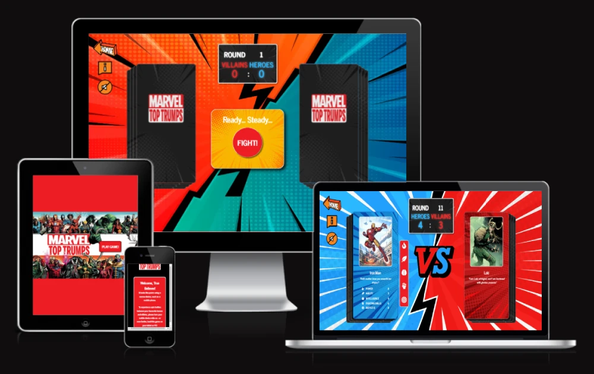

Marvel Top Trumps is a virtual card game featuring heroes and villains from Marvel Comics. Each card depicts a Marvel character with their own unique stats. These stats are rated from 1 - 10 across 5 different categories: Power, Agility, Intelligence, Fighting Skills and Battle IQ. Each round, once the cards have been dealt, the User must select which stat they want to play against their opponent. Whoever has the higher stat wins the round. Whilst the User can see what character their opponent is using each round, they cannot see their opponent's stats. The User must therefore rely on their knowledge of Marvel characters (or blind luck) to win each round.

Before starting the game, the User must choose which deck of cards they want to play with - the Hero Deck or the Villain Deck. Whichever they choose, the opposite deck will be used by their CPU opponent. The game is concluded when either the User or the opponent wins 7 rounds, or the User runs out of cards. The User starts each game with 14 cards.

The overall design of the game has been styled after classic comic books with a slight modern touch. This was achieved using a mix of bright colours and pop-art backgrounds to evoke a comic book aesthetic, contrasted with more modern design choices, such as glowing text and video-game themed Game Over menues.

The website essentially features two areas: the homepage, where the User selects their deck of cards, and the playing area (with slight design differences based on whether the User has chosen to play with the Hero or Villain Deck). Once the User has entered the playing area, they can use the 3 orange settings buttons to  navigate back to the homepage, open the 'How to Play' window for instructions on how to play the game, and toggle SFX on and off.

As the game design utilises a landscape design, any device with a viewport width of less than 600px will be displayed a message stating that their device is too narrow. This message advises users to turn their device on it's side (if using a mobile) or to switch to a tablet or PC. This way all devices can still be accommodated, without sacrificing the landscape design.

[Play the Marvel Top Trumps live project here.](https://mattmiles95.github.io/PP2_Marvel_Top_Trumps/)

## Table of Contents

### [User Experience (UX)](#user-experience-ux-1)
* [User Stories](#user-stories)
### [Design](#design-1)
* [Colours](#colours)
* [Typography](#typography)
* [Images](#images)
* [Wireframes](#wireframes)
* [Accessibility](#accessibility)
* [Responsiveness](#responsiveness)
### [Features](#features-1)
* [Homepage](#homepage)
* [The Play Button](#the-play-button)
* [Choice of Card Deck](#choice-of-card-deck)
* [The Game](#the-game)
* [Start of the Game](#start-of-the-game)
* [The Cards](#the-cards)
* [User Buttons Panel](#user-buttons-panel)
* [Round Results](#round-results)
* [Scoreboard](#scoreboard)
* [Game Over](#game-over)
* [Options Buttons](#options-buttons)
* [Gameplay Mechanics](#gameplay-mechanics)
* [SFX](#sfx)
* [Favicon](#favicon)
### [Future Features](#future-features-1)
* [Developer Features](#developer-features)
* [User Features](#user-features)
### [Technologies Used](#technologies-used-1)
* [Languages](#languages)
### [Frameworks, Libraries & Programs Used](#frameworks-libraries--programs-used-1)
### [Testing](#testing-1)
* [Validators](#validators)
* [Lighthouse Testing](#lighthouse-testing)
* [Manual Testing](#manual-testing)
* [Bugs & Fixes](#bugs-and-fixes)
### [Local Development & Deployment](#local-development--deployment-1)
* [Local Development](#local-development)
* [Deployment](#deployment)
* [Forking the GitHub Repository](#forking-the-github-repository)
* [Local Clone](#local-clone)
### [Credits](#credits-1)
* [Affiliations](#affiliations)
* [Copy (Written Material)](#copy-written-material)
* [Media](#media)
* [Online Resources](#online-resources)

### User Experience (UX)
Marvel Top Trumps is a website for people that enjoy simple card games and the superhero genre. As that encompasses a very wide audience, the website caters for a spectrum of users from all ages and backgrounds. This is achieved with a heavy focus and consistency on the theme of comic books (as this is should be mutual ground for all users) and a simple, accessible game design.

#### User Stories

##### Initial User Goals – First Impressions
* Immediately recognise and understand the theme of the game 
* Easily navigate the game’s features  
* Evoke excitement to play the game

##### Established User Goals – Once They’ve Stayed 
* Provide an enjoyable and rewarding gameplay loop that holds the User's attention
* Provide satisfying User feedback when interacting with the wesbite
* Offer enough variety to keep the user engaged without creating unwanted complexity

### Design

#### Colours
Marvel Top Trumps utilises several different colour schemes to establish a clear divide between different features. However, these different schemes each share the pop-art / comic book asthetic (vibrant, high-contrast colours), to provide a sense of consistency throughout the website.

* Marvel's iconic red and white colour-scheme for neutral features:

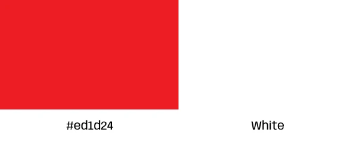

* Traditional blues and reds to depict opposing teams (heroes and villains, respectively):

* Orange, white and black for Options buttons:

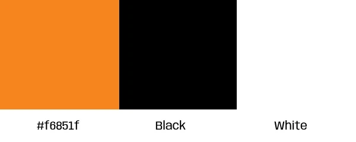

* Greens and reds for wins and losses:

* Yellows for neutral backgrounds:

#### Typography
I chose to use the Google Font, "News Cycle", as the primary font for my website. This was due to the font closely mirroring the style of Marvel's own font, 'Fakt Soft Pro', used in their iconic logo. Both share a vaguely "old-school" print aesthetic, with the benefit of a Google Font being widely accessible across many browsers. 'Impact' was my fallback font in case the User's browser does not support News Cycle, with sans-serif as the websafe choice.

#### Images 
The majority of background images I have used share the same pop-art / comic book aesthetic, to establish an immediately identifiable theme. This compliments the images used to depict each charcter, as each card features comic book art for the respective hero / villain. 

#### Wireframes
I used wireframes to express my initial design ideas for the game. 

A sample of my initial wireframes:

#### Accessibility
To ensure every User has equal opportunity to enjoy my game, I ensured maximum accessibility in its design and code:
 
* Alt text and aria-labels are used throughout the site to aid screen readers.

* All colour schemes utilise contrast between background and foreground to ensure ease of readability. All background/foreground contrasts were tested using [WebAIM Contrast Checker](https://webaim.org/resources/contrastchecker/) and recieved passing grades across the board.

Screenshot of Contrast Checker to demonstrate test:

#### Responsiveness
As my game utilises a landscape format, I initially designed the website for use on larger screens and then adjusted its responsiveness on smaller devices from there. 

As explained above, any device with a viewport width of less than 600px will be displayed a message stating that their device is too narrow, and to turn it on its side to access landscape mode. 

My decision to restrict usage of the game to viewports with a minimum width of 600px was to avoid having to compromise the overall design and aesthetic of the game in order to adjust to very narrow viewports. Ultimately, this is at no cost to accessibility, as the only devices more narrow than 600px are mobile phones, which have the ability to be turned on their side to increase their viewport width. I have catered specifically for landscape mobile phones by including several media queries that adjust to wide, yet short viewports. In doing so, I feel I have managed to maintain a high quality of User Experience without sacrificing accessibility.

Another reason for ensuring my game can be played across a wide range of devices was to ensure a good SEO - as search engines are more favourable to websites that are mobile phone-friendly. 

Screenshot of narrow screen warning message:

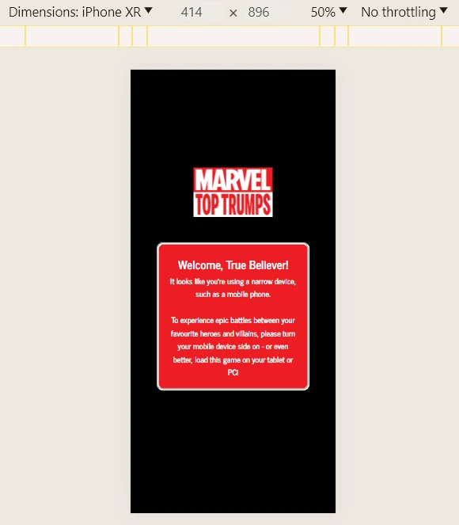

### Features

#### Homepage
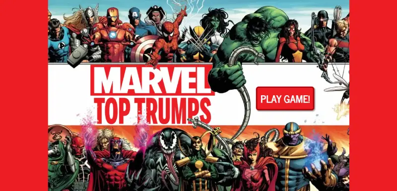

The purpose of the homepage is very simple - to capture the User's attention and make them want to play the game. For this reason, I have opted for a very minimalist approach to design features, to avoid the User being overwhelmed or distracted by other content.

The background image features Marvel heroes along the top, a white space in the centre, and Marvel villains along the bottom. This imagery reflects the nature of the game; Marvel heroes vs Marvel villains. Using a photo editor, I created a logo for the game and placed this within the white space of the image. I then layered the parts of the image that overlap the white space to also overlap the logo, giving more depth to the imagery.

#### The Play Button

The only interactive feature the User is met with when opening the site is a large red button containing a simple call to action: "Play Game". The Button is set against a plain white background to ensure it grabs the User's attention. When hovering the cursor over the button, the text begins to expand and glow, the box shadow fades away (giving the impression of a button being pressed) and the cursor becomes a pointer. This provides the User with a satisfying feedback response, making the button feel interactive.

#### Choice of Card Deck
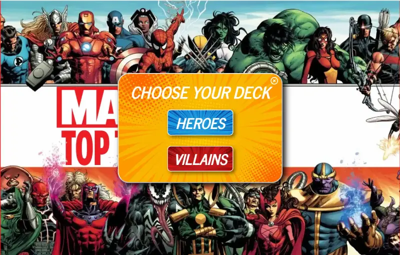

Upon clicking the Play button, a window opens within the centre of the page, offering the User a choice: "Choose your deck". At the same time, the Play button disappears, to eep the User's focus on the present choice. There are three buttons within this window:

1. A small white cross in the top right corner, allowing Users to close the window. Upon doing this, the "Play" button reappears.
2. A blue button for the Heroes deck
3. A red button for the Villains deck

Both the Heroes and Villains buttons use similar hover effects as the Play button to provide feedback to the user. Clicking either button takes the User through to the respective game page.

#### The Game

Once the user has selected the deck of cards they wish to play with, they are taken to either the Heroes game or the Villains game. The layout of both is entirely the same, only mirrored to ensure the User's deck and score are always displayed on the left half of the screen, with the opponent's deck and score on the right. The background image also changes to reflect this mirrored design, as well as the Villains game using slightly darker tones. 

#### Start of the Game

Initially, the User is met with two decks of cards, all face down. In the centre of the screen is a window with a big red button conatining the word, "Fight!". Upon clicking this this button, the top card of each deck is flipped over (animated using CSS and JavaScript) revealing the User's and opponent's playing cards.

#### The Cards
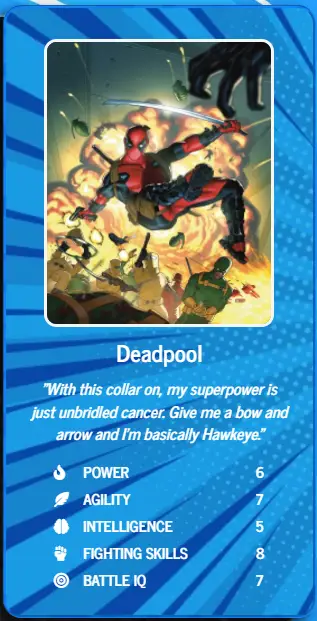
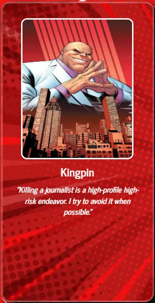

The User's card features an image of the character, their name, a quote from them, and their stats. The opponent's card features all of the same things, with the exception of their stats, which are hidden from the User.

#### User Buttons Panel

Once the cards have been turned over, a panel of buttons appears beside / below the User's card (the exact position depending on the device being played on). This panel contains 5 symbols that mirror the symbols found beside each stat (i.e., a flame for Power, a feather for agility, etc.). This is how the User selects which stat they wish to play against their opponent. Once clicked, the game compares the values of the User's stat vs the opponent's stat and determines if the User wins, loses or draws the round.

#### Round Results
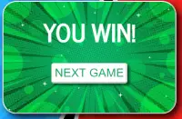
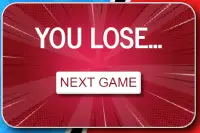
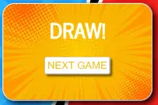

Upon playing a stat, the User's button panel disappears and a results window opens in the centre of the screen, confirming whether they won, lost or drew the round. This window contains another button, containing the words "Next game". Once they User clicks this button, a new round starts and all elements are reset, with the 'Fight' button reappearing at the centre of the screen and both cards being turned facedown again.

#### Scoreboard
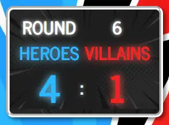

At the top of the screen is the scoreboard, which keeps track of how many rounds have been played and how many points each side has scored. This is important, as the game will end when either one team reaches 7 points, or 14 cards have been played (the limit of each deck). Once one of these parameters is met, another window opens at the centre of the screen, confirming that either the User has won the game, lost or run out of cards.

#### Game Over

As stated above, there are three parameters for the game ending: the User winning, the User losing, or the User running out of cards. Each of these game endings have a specific themed "Game-Over" window pop up in the centre of the screen. Whilst all different in appearence and text content, each offers the User the same options: 

* "Play Again" - a button that, when clicked, restarts the game from the beginning.

* "Change Deck" - a button that, when clicked, takes the User to the other version of the game (i.e., from the Heroes game to the Villains game, or vice versa).

* "Exit" - a button that, when clicked, takes the User back to the homepage.

When the Game Over screen appears, the background image is blurred and the Options buttons disppear, to draw focus to the Game Over screen and stop other features from being triggered in the background (such as opening the How to Play window). 

#### Options Buttons

In the top-left corner of the screen are three "Options" buttons, identified by their shared colour scheme of orange, white and black.

The first button, a backwards facing arrow containing the word "Home", takes the User back to the homescreen, where they can reselect their deck of cards.

The second button, a comicbook-style speech bubble containing the universal "info" symbol, opens a window in the centre of the screen with instructions on how to play the game and its rules. This window can be closed using the white cross button in the top right corner of the window.

The third button is a toggle switch for the games SFX. By default (and inline with best practices), SFX are turned off, represnted by a speaker symbol with a line through it. When toggled 'on', the symbol is replaced with a speaker showing 3 audio waves coming from it. 

Each of the buttons expand and glow when the cursor is hovered over them, and the cursor becomes a pointer, to provide good feedback to the User.

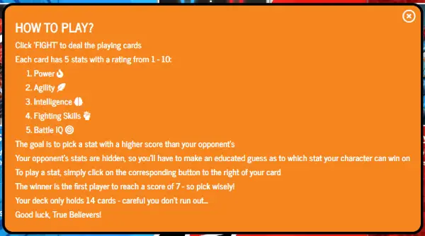

#### Gameplay Mechanics

The game created by having two arrays, one of Heroes and one of Villains. Each time the Fight button is clicked, a character from each array is randomly selected and displayed as the User's and opponent's top card. Once a character has been selected, they are removed from their respective array, so to prevent repitition. This was the primary purpose for including a 'deck limit' - to prevent the arrays from being emptied and breaking the game. Each array has 18+ characters to choose from, ensuring good variety for the User.

#### SFX

I have included in my game the option for the User to have sound effects toggled on or off. I have used sounds to make the game more immersive and provide additional User feedback for interacting with the game; such as a sound of a page turning when the cards are flipped, trumpet fanfare when the User wins, and various 'clicking' and 'popping' sounds when clicking buttons, to name a few examples. 

#### Favicon
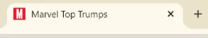

For my Favicon, I have used the iconic Marvel symbol of a red letter 'M', as this would be immediately recognisable amongst my target audience.

### Future Features

#### Developer Features

* When initially writing my code, I depended heavily on using template literals to push hard code into my game’s HTML files to build each playing card. It was only upon creating multiple characters for each JS array that I realised how inefficient this method was, as it required huge amounts of copy and pasting code that then needed to have small details individually. The vast amount of code also required me to split the JavaScript across 3 separate files (one for each html file) to keep the code from becoming too messy.

* A future feature I would add would be to entirely refactor this section of the JavaScript for my game. Each property within the playing cards’ divs would be written into the respective HTML file, with each value set to a placeholder. Instead of the JavaScript variables for each character being a template literal, I would set parameters for each value within the playing cards (being the image, character name, quote and stat). This way, once a character is randomly selected from their array, just their individual parameters are pulled through to the HTML file, rather than the entire code for the playing card itself.

* This would allow for much less verbose JavaScript, which would greatly improve readability as well as efficiency for working on the code at a later date.

#### User Features

* A future feature I would like to add to the game is a difficulty setting, to make it more accessible for Users with a wider spectrum of knowledge regarding Marvel characters. ‘Easy’ mode would have the opponent’s stats colour coded to indicate their strengths and weaknesses, without outright telling the User their stats (i.e., a green circle for stats ranging 1 – 3, amber circle for 4 – 7 and red for 8 – 10). ‘Normal’ mode would be the game as currently deployed. ‘Hard’ mode would also hide the User’s stats, requiring them to rely much heavier on their knowledge of the characters.

* Other future features I’d like to add are the following game modes to add variety for the User:

1. ‘Battle Royale’ mode, where the User can use a mixed deck of heroes and villains.

2. ‘Survival’ mode, where the User sees how many consecutive rounds they can win before being defeated.

* Another feature I would like to add is a variety of different card decks, as opposed to just ‘Heroes’ and ‘Villains’. For example, a deck of just X-Men cards, or multi-verse Spider-Man variants, etc.

* Over time, I would like to add more characters to the rosters, to keep the game feeling fresh for users.

### Technologies Used

#### Languages 
* [HTML 5](https://en.wikipedia.org/wiki/HTML5)
* [CSS 3](https://en.wikipedia.org/wiki/CSS#CSS_3)
* [JavaScript](https://en.wikipedia.org/wiki/JavaScript)

### Frameworks, Libraries & Programs Used

* [Visual Studio Code](https://code.visualstudio.com/)
    - IDE.

* [Git](https://git-scm.com/)
    - Version control system.

* [GitHub](https://github.com/)
    - Online storing of repository and deployment of website.

* [Google Fonts](https://fonts.google.com/)
    - Import primary font for website.

* [Font Awesome](https://fontawesome.com/)
    - Import several icons.

* [Balsamiq](https://balsamiq.com/)
    - Wireframing tool.

* [Freepik](https://www.freepik.com/)
    - Library of stock images.

* [Photopea](https://www.photopea.com/)
    - Photo editing software.

* [Chrome DevTools](https://developer.chrome.com/docs/devtools)
    - For testing and auditing code.

* [Chrome Eye Dropper](https://chromewebstore.google.com/detail/eye-dropper/hmdcmlfkchdmnmnmheododdhjedfccka)
    - For sampling colours.

* [WebAIM Contrast Checker](https://webaim.org/resources/contrastchecker/)
    - For testing foreground/background contrasts.

### Testing

#### Validators

To ensure there were no errors in the syntax of my code, each file was separately validated using direct input in the [W3C Markup Validator](https://validator.w3.org/#validate_by_input), the [W3C CSS Validator](https://jigsaw.w3.org/css-validator/) and [JSHint](https://jshint.com/)

##### HTML

index.html

game-heroes.html

game-villains.html

##### CSS

style.css

##### JavaScript

home.js

heroes.js

villains.js

#### Lighthouse Testing

I used the Google Lighthouse tool to test the performance, accessibility, SEO and best practices of each of webpages, generating reports for both mobile and desktop performance on each.

##### Lighthouse Test Results

index.html

heroes.html

villains.html

#### Manual Testing 

##### Table of Results 
To test the functionality of my JavaScript, myself and several friends and family play tested the game on various devices. I then compiled the data in the following table:

<table>

##### Browsers and Devices

###### Browsers
* Google Chrome
* Microsoft Edge
* Mozilla Firefox
* Safari

###### Devices
* Samsung Galaxy S23 Ultra (412 x 750) 
* iPhone 13 (390 x 661)
* Apple iPad 8th Gen (580 x 548)
* 15.6" Portable Monitor (1280 x 551)
* 15.6" Windows Laptop (1536 x 695)

(The above viewports were calculated using [whatismyviewport.com](https://whatismyviewport.com/) on each devices' maximised browser window.)

The following features were manually tested on each of the above browsers and devices: 

* General performance
* Script functionality
* Responsiveness
* Google Fonts
* Internal links
* Hover animations

#### Bugs and Fixes

During the development of my game, I encountered several bugs that required fixes. I have documented these in the table below:

<table>

### Local Development & Deployment

#### Local Development

The website was developed using Visual Studio Code, with all local files stored in my Dropbox to provide a cloud-based backup. All live code is stored in my GitHub repository – PP2_Marvel_Top_Trumps (via routine 'git push' commands). The following VS Code extensions were used in the development of the website:

* Git

* GitHub Codespaces

* GitHub Repositories

* Live Server

#### Deployment 

This site was deployed via GitHub Pages, using the following steps:

1. Open the GitHub repository - [PP2_Marvel_Top_Trumps](https://github.com/MattMiles95/ PP2_Marvel_Top_Trumps).

2. Select the Settings tab.

3. Open the source-selection dropdown menu and select "Main Branch"

Upon completion of the above steps, refresh the repository homepage and scroll to the Deployments section on the right-hand side of the page. Click on "github-pages" and follow the link to the live project.

#### Forking the GitHub Repository
Forking the repository creates a copy of the original, allowing us to view and change the repository without affecting the original. This can be done by following the below steps:

1. Open the GitHub repository - [PP2_Marvel_Top_Trumps](https://github.com/MattMiles95/ PP2_Marvel_Top_Trumps).

2. Select the "Fork" button in the top-right section of the page.

A copy of the repository should now be in your own GitHub account.

#### Local Clone
Cloning the repository allows you to copy the files into your own IDE for local development. This can be done by following the below steps:

1. Open the GitHub repository - [PP2_Marvel_Top_Trumps](https://github.com/MattMiles95/ PP2_Marvel_Top_Trumps).

2. Navigate the 'Code' dropdown menu and select whether you wish to clone the code using HTTPS, SSH or GitHub CLI.

3. Open the a Git Bash terminal in your chosen IDE and navigate your working directory to the location you wish to clone the project.

4. Use the command 'git clone' followed by the link you copied from the repository. 

### Credits

#### Affiliations

"Marvel Top Trumps" is a game created by me solely for the purpose of this project. Any partnership or affiliation with Marvel alluded to within the game is entirely fictional and in no way represents their views.

#### Copy (Written Material)

* All copy used in the website was written by me.

* The character quotes used in the game are all direct quotes from Marvel source material, including films, television shows and comic books (notwithstanding ‘the Creator’ card).

#### Media

* All background images (notwithstanding the hero image used on the homepage) were obtained from [FreePik](https://freepik.com/).

* The hero image used for the homepage background was obtained from [MrWallpaper](https://mrwallpaper.com/wallpapers/cute-superheroes-x-marvel-villains-273jen8gcggcgfag.html).

* All character images were obtained from [Marvel Database](https://marvel.fandom.com/wiki/Marvel_Database).

* All rights to the Marvel characters featured in this game and any Marvel trademark belong to Marvel Comics.

* All audio files were obtained from [Pixabay](https://pixabay.com/).

#### Online Resources

* [Photopea](https://www.photopea.com/) was used extensively throughout this project to edit the appearance of the images used, create new images and to convert image files to .webp format for optimisation.

* [Google Fonts](https://fonts.google.com/) was used to import the primary font for the website, "News Cycle".

* [Font Awesome](https://fontawesome.com/) was used for the stat symbols on each playing card.